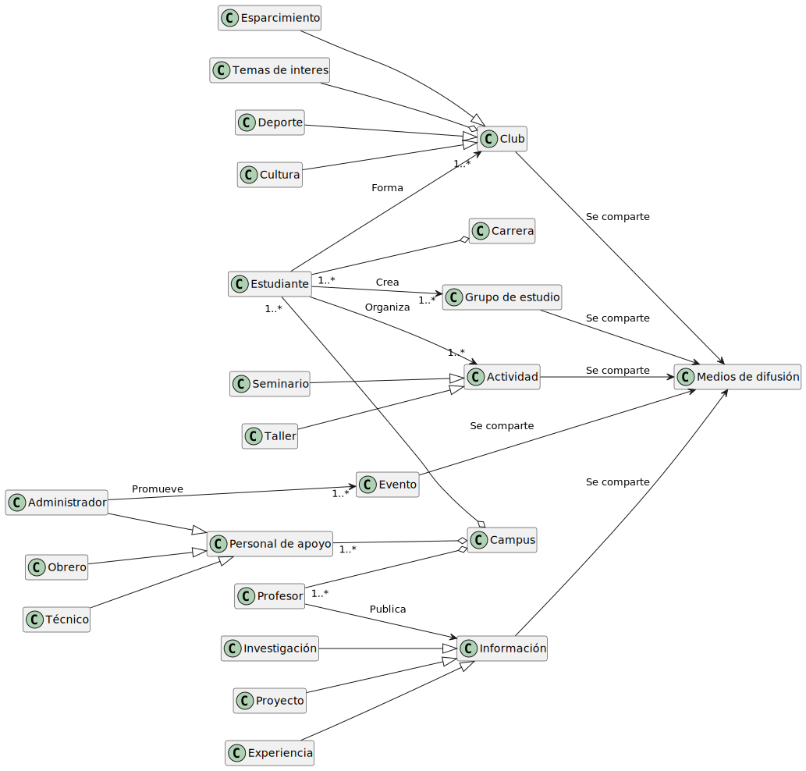
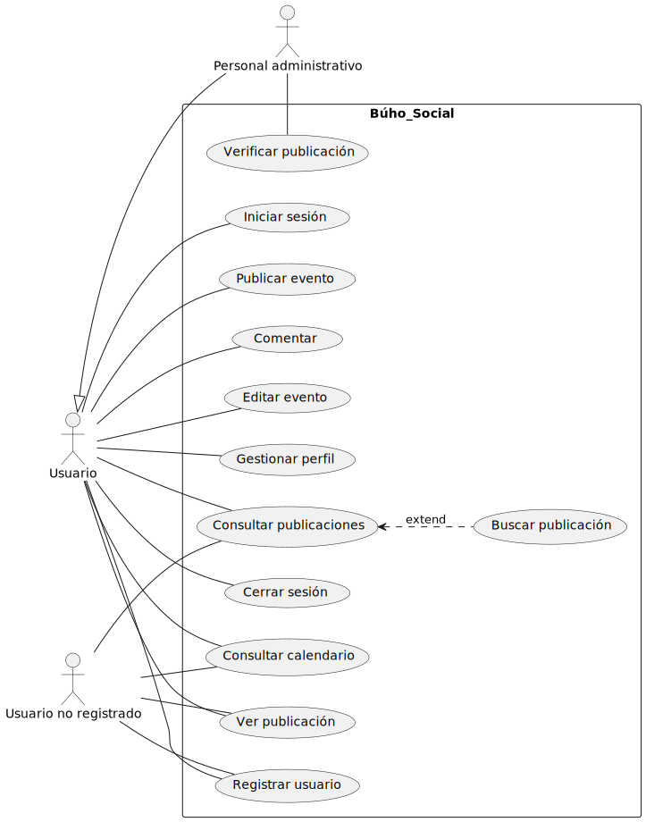

## PROYECTO
    BÚHO SOCIAL

## INTEGRANTES
    29922041	DAYANNIS MARIA	COLMENARES MARQUINA
    31307754	CARLOS ALBERTO	HEYDRA MARIN
    30871641	JESÚS JAVIER	MARCANO MORA
    30514382	DANIELA ALEXANDRA	MARIN TORRES
    31708119	AMANDA MERCEDES 	MENDOZA HERNÁNDEZ 

## MODELO DE DOMINIO
### Diagrama de clases:

### Diagrama de estados:

## MODELO DE CASOS DE USO
### Diagrama de casos de uso

### Diagrama de estados de casos de uso:

### Especificación de los casos de uso:

### Prototipo de pantallas:

### Flujo de usuario:

## MODELO DE ANÁLISIS
### Diagrama de clases de análisis:

### Diagrama de paquetes de análisis:

### Diagrama de clases de análisis y de colaboración de casos de uso prioritarios:

#### UC-1

#### UC-2

#### UC-3

#### UC-4

## MODELO DE DISEÑO
### Diagrama de clases:

### Diagrama de traza:

### Diagrama de secuencia:

### Modelo de despliegue:

## MODELO DE IMPLEMENTACIÓN
